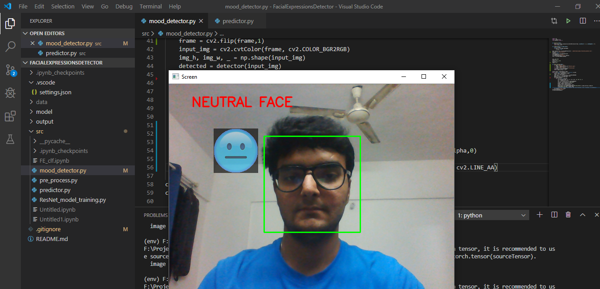

# Mood-Inspector
A tool to detect and categorize grammatical facial expression.

## Requirements

OpenCV, PyTorch are the main packages being used in this project.
Use the package manager [pip](https://pip.pypa.io/en/stable/) to install the requirements.

```bash
pip install torch
pip install cv2
pip install pandas
```

## Data

Data used for the project was obtained from github. Link to the github repository: https://github.com/muxspace/facial_expressions

## Usage

```bash
python mood_detector.py
```

## Working Output 
Output1: 
Output2: .png)

## Contributing
Pull requests are welcome. For major changes, please open an issue first to discuss what you would like to change.

Please make sure to update tests as appropriate.

## License
[MIT](https://choosealicense.com/licenses/mit/)
